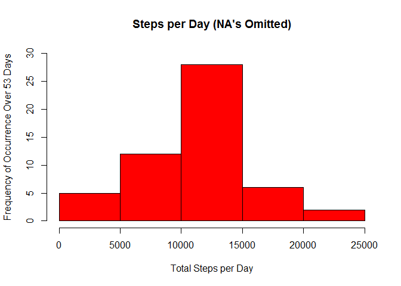
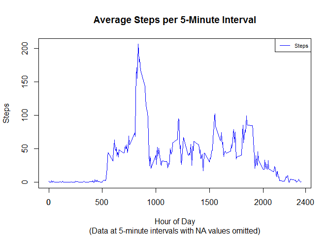
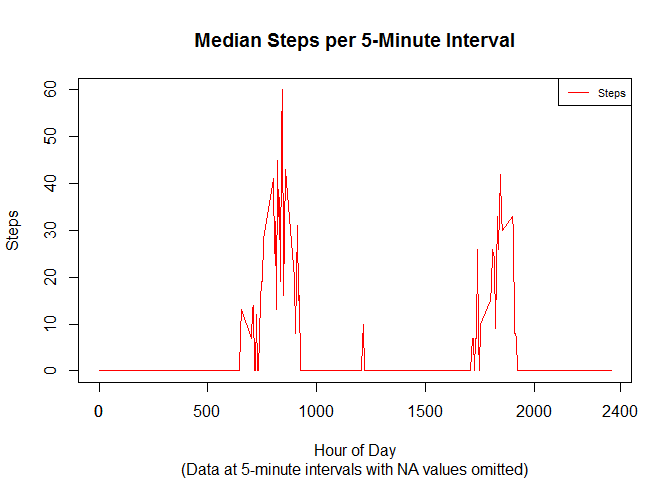
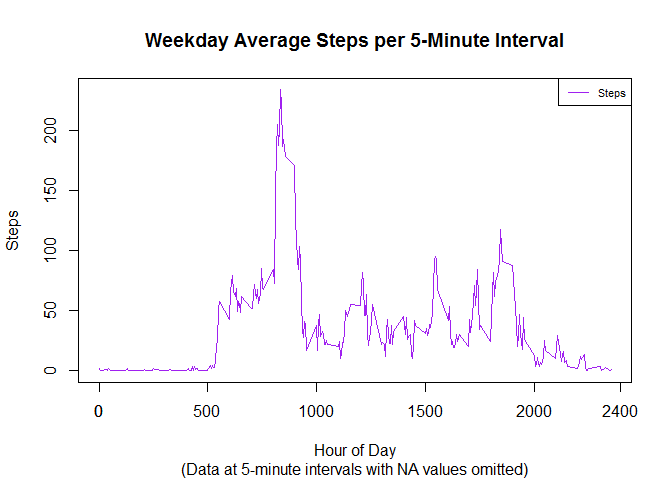
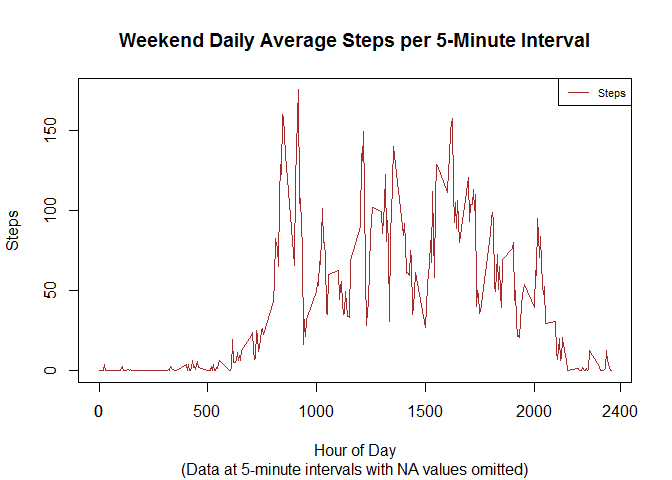
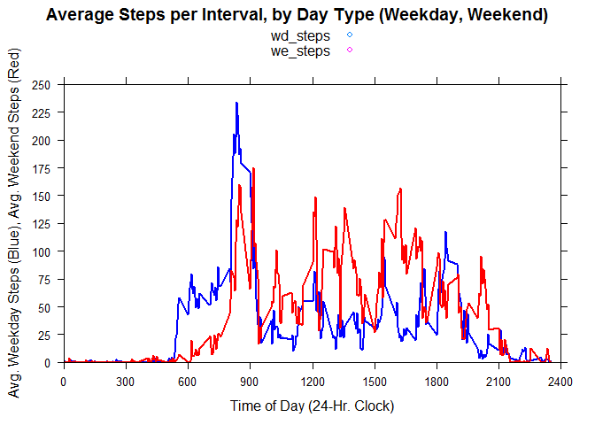
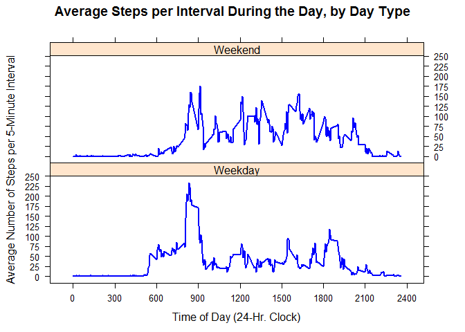

# Peer Assessment 1

### Coursera - 4 - Reproducible Research

Submitter:  A. Nichols

19 July 2015

The code described below will read-in physical fitness data (i.e., the "activity.csv" file, provided) and produce the histogram and time series plots shown below.

The first step is to load the "dplyr" and "lubridate" packages for R, as shown below, and to read in the physical fitness data from a .csv file.  The file includes a header row with the names for three columns ("steps", "date", and "interval"), followed by 17568 rows of fitness data.  

The fitness data described the number of steps a person took each day (in 5-minute increments) during a 53-day period from October 1, 2012, to November 30, 2012.  The data had to be cleaned up and consolidated to make the figures provided below.


```r
library(dplyr)
```

```
## Warning: package 'dplyr' was built under R version 3.2.1
```

```
## 
## Attaching package: 'dplyr'
## 
## The following objects are masked from 'package:stats':
## 
##     filter, lag
## 
## The following objects are masked from 'package:base':
## 
##     intersect, setdiff, setequal, union
```

```r
library(lubridate)
```

```
## Warning: package 'lubridate' was built under R version 3.2.1
```

```r
data1df <- read.table(
	"C:/Users/Andrew/Documents/Coursera/Data_Science_JHU/5_-_Rep_Res/pa1/activity.csv",
	header=TRUE,
	sep = ",",
	col.names = c("steps", "date", "interval"),
	colClasses=c("numeric", "character", "numeric"), 
	na.strings=c("NA")
)
data1df$date <- strptime(data1df$date, format="%Y-%m-%d")
data1df$date <- ymd(data1df$date)	# Use lubridate to ensure correct date format
data1tbl <- tbl_df(data1df) 		# Create tbl out of initial data frame
data2tbl <- mutate(data1tbl, 
	new_steps=steps,
	day_num=wday(date), 
	day=weekdays(date))
data2df <- data.frame(data2tbl)
data3df <- cbind(data2df, "weekday"=0)

data3df$weekday[(data3df$day_num >= 2) & (data3df$day_num <= 6)]<- 1	

data3tbl <- tbl_df(data3df)
data3tbl <- select(data3tbl, date, interval, day, day_num, weekday,
	steps, new_steps)
data4df <- data.frame(data3tbl)  	# Baseline data sets
data4tbl <- data3tbl
```


The histogram shown here describes the total number of steps a person took each day during a 53-day period from October 1, 2012, through November 30, 2012.  The histogram bins the daily counts and shows the frequency with which a person took a given number of steps.

Strategy for missing data:  In the original data set, some values for "steps" were missing, and coded as "NA" (not available).  In this analysis, the NA step values have been removed (ommitted).  You can see this happening in the five filter statements in the code that include "!is.na(steps)".  The histogram shown below shows the total number of steps taken each day after missing values were imputed (i.e., removed).


```r
# Histogram 1 (NA's Omitted)##################################
data5tbl <- select(data4tbl, date, steps)
data5tbl <- filter(data5tbl, !is.na(steps))
data5df <- data.frame(data5tbl)
data5df$date <- as.character(data5df$date)
by_date_sums <- aggregate(steps ~ date, data=data5df, FUN=sum)
```


```r
hist(by_date_sums$steps, 
	col="Red",
	bg="White",
	main="Steps per Day (NA's Omitted)",
	xlab="Total Steps per Day",
	ylab="Frequency of Occurrence Over 53 Days",
	ylim=c(0, 30)
)
```

 


A call to summary(by_date_sums) reveals the maximum and minimum number of steps the person took per day (Note: NA values have been omitted), along with the mean and median values for the 53-day period.

Mean:       10766  steps per day

Median:     10765  steps per day

Maximum:    21194  steps per day

Minimum:       41  steps per day


```r
summary(by_date_sums)
```

```
##      date               steps      
##  Length:53          Min.   :   41  
##  Class :character   1st Qu.: 8841  
##  Mode  :character   Median :10765  
##                     Mean   :10766  
##                     3rd Qu.:13294  
##                     Max.   :21194
```


Here is a time series plot of the AVERAGE number of steps taken per 5-minute interval during the day (the average level per similar interval across all 53 days).  The intervals are shown on a 24-hour clock basis (0000 to 2400 hours).  (Each 24-hour day includes 288 5-minute intervals.)


```r
# Time Series 1 (Average Steps per Day ################################
data10tbl <- select(data4tbl, interval, steps)
data10tbl <- filter(data10tbl, !is.na(steps))
data10df <- data.frame(data10tbl)
by_interval <- aggregate(steps ~ interval, data=data10df, FUN=mean)
```


```r
with(by_interval, plot(interval, steps, type="n",
	main="Average Steps per 5-Minute Interval",
	sub="(Data at 5-minute intervals with NA values omitted)", 
	xlab="Hour of Day",
	ylab="Steps"
	)
)
with(by_interval, points(interval, steps,
		type="l",
		lwd="1.9", 
		col="Blue",
		axis(side=1, at = c(0, 2400))
	)
)
text1 <- c("Steps")
legend("topright", 
	legend=text1,
	col=c("Blue"),
	lty=1,
	cex=0.7
)
```

 


On average, the maximum number of steps taken in a particular day was 206.17, and it occurred during interval 835 (i.e., at 8:35 a.m.), as shown by the following code.


```r
summary(by_interval)
```

```
##     interval          steps        
##  Min.   :   0.0   Min.   :  0.000  
##  1st Qu.: 588.8   1st Qu.:  2.486  
##  Median :1177.5   Median : 34.113  
##  Mean   :1177.5   Mean   : 37.383  
##  3rd Qu.:1766.2   3rd Qu.: 52.835  
##  Max.   :2355.0   Max.   :206.170
```

```r
max1 <- tbl_df(by_interval)
filter(max1, steps>206)
```

```
## Source: local data frame [1 x 2]
## 
##   interval    steps
## 1      835 206.1698
```


Here is a time series plot of the MEDIAN number of steps taken per 5-minute interval during the day (the median level per similar interval across all 53 days).  The intervals are shown on a 24-hour clock basis (0000 to 2400 hours).  (Each 24-hour day includes 288 5-minute intervals.)


```r
# Time Series 2 (Median Steps per Day) ###############################
data20tbl <- select(data4tbl, interval, steps)
data20tbl <- filter(data20tbl, !is.na(steps))
data20df <- data.frame(data20tbl)
by_interval2 <- aggregate(steps ~ interval, data=data20df, FUN=median)
```


```r
with(by_interval2, plot(interval, steps, type="n",
	main="Median Steps per 5-Minute Interval",
	sub="(Data at 5-minute intervals with NA values omitted)", 
	xlab="Hour of Day",
	ylab="Steps"
	)
)
with(by_interval2, points(interval, steps,
		type="l",
		lwd="1.9", 
		col="Red",
		axis(side=1, at = c(0, 2400))
	)
)
text1 <- c("Steps")
legend("topright", 
	legend=text1,
	col=c("Red"),
	lty=1,
	cex=0.7
)
```

 


The two time-series plots shown below show the average number of steps taken per 5-minute interval for weekdays (the first plot), and for weekend days (the second plot).  (The two plots are not in the same panel, per se, but are on the same scale and are positioned similarly.)


```r
# Weekday Average #################################################
data30tbl <- select(data4tbl, interval, steps, weekday)
data30tbl <- filter(data30tbl, weekday==1, !is.na(steps))
data30df <- data.frame(data30tbl)
by_interval <- aggregate(steps ~ interval, data=data30df, FUN=mean)
```


```r
with(by_interval, plot(interval, steps, type="n",
	main="Weekday Average Steps per 5-Minute Interval",
	sub="(Data at 5-minute intervals with NA values omitted)", 
	xlab="Hour of Day",
	ylab="Steps"
	)
)
with(by_interval, points(interval, steps,
		type="l",
		lwd="1.9", 
		col="Purple",
		axis(side=1, at = c(0, 2400))
	)
)
text1 <- c("Steps")
legend("topright", 
	legend=text1,
	col=c("Purple"),
	lty=1,
	cex=0.7
)
```

 


```r
# Weekend Daily Avg ##############################################
data40tbl <- select(data4tbl, interval, steps, weekday)
data40tbl <- filter(data40tbl, weekday==0, !is.na(steps))
data40df <- data.frame(data40tbl)
by_interval3 <- aggregate(steps ~ interval, data=data40df, FUN=mean)
```


```r
with(by_interval3, plot(interval, steps, type="n",
	main="Weekend Daily Average Steps per 5-Minute Interval",
	sub="(Data at 5-minute intervals with NA values omitted)", 
	xlab="Hour of Day",
	ylab="Steps"
	)
)
with(by_interval3, points(interval, steps,
		type="l",
		lwd="1.9", 
		col="Brown",
		axis(side=1, at = c(0, 2400))
	)
)
text1 <- c("Steps")
legend("topright", 
	legend=text1,
	col=c("Brown"),
	lty=1,
	cex=0.7
)
```

 


Adding xypanel plot for number of steps on weekdays and weekend days (this combines the previous two graphics).


```r
# To create panel plot, use existing tbl's for weekday steps
# and weekend steps.  Combine these in one data frame with
# intervals, then call lattice's xyplot to create the panel

library(lattice)					# Get weekday step data
by_interval_weekday <- by_interval		# Prep to add weekend steps
wddf <- data.frame(by_interval_weekday)	
names(wddf)[names(wddf)=="steps"] <- "wd_steps"	# Add placeholder col.
wddf <- cbind(wddf, "we_steps"=0)

by_interval_weekend <- by_interval3		# Get weekend step data
wedf <- data.frame(by_interval_weekend)	
wddf$we_steps <- wedf$steps			# Add weekend steps to df
combdf <- wddf					# Rename df for clarity

xyplot(wd_steps + we_steps ~ interval, 
	data=combdf,
	type="l",
	lwd="2",
	col=c("Blue", "Red"),
	auto.key=T,
	xlab="Time of Day (24-Hr. Clock)", 
	ylab="Avg. Weekday Steps (Blue), Avg. Weekend Steps (Red)", 
	xlim=c(0, 2400),
	ylim=c(0, 250),
	scales=list(x=list(at=seq(0, 2400, 300)),
		y=list(at=seq(0, 250, 25))),
    	main="Average Steps per Interval, by Day Type (Weekday, Weekend)",
	sub=""
)
```

 


For good measure, here is a new 2-panel plot in the "over/under" format requested.


```r
data40df <- data4df
data40df$weekday[(data40df$day_num >= 2) & (data40df$day_num <= 6)]<- c("Weekday")
data40df$weekday[(data40df$day_num == 1) | (data40df$day_num == 7)]<- c("Weekend")  

steps_by_daytype <- aggregate(new_steps ~ interval + weekday, data = data40df, mean)
names(steps_by_daytype) <- c("interval", "weekday", "steps")

xyplot(steps ~ interval | weekday, 
	data=steps_by_daytype, 
	type = "l", 
	lwd="2",
	col=c("Blue"),
	layout = c(1, 2), 
	xlab="Time of Day (24-Hr. Clock)", 
	ylab = "Average Number of Steps per 5-Minute Interval",
	scales=list(x=list(at=seq(0, 2400, 300)),
		y=list(at=seq(0, 250, 25))),
	main="Average Steps per Interval During the Day, by Day Type"
)
```

 
